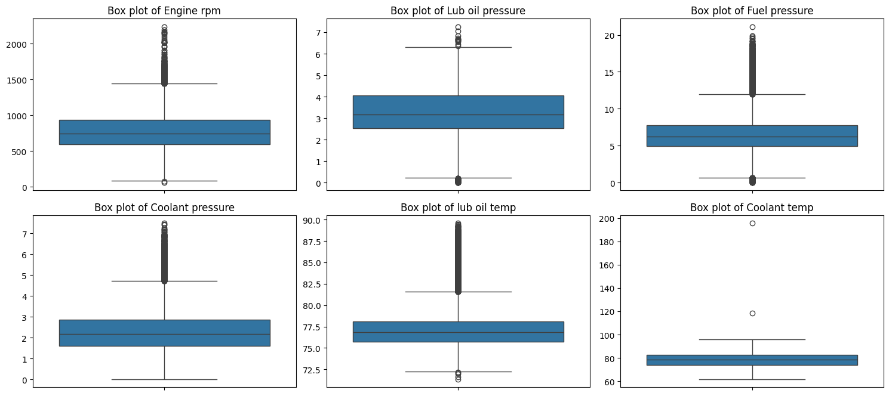
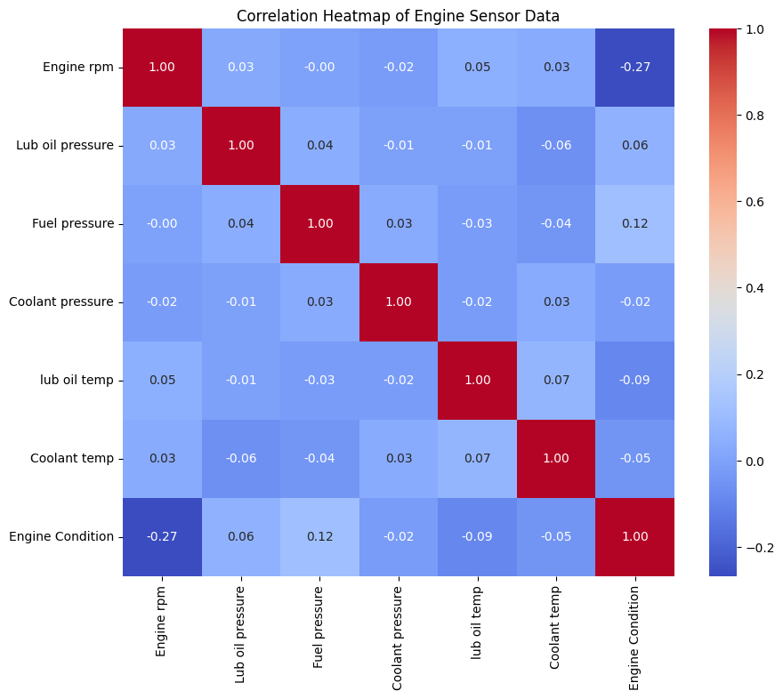

# Engine Sensor Data Analysis for Failure Prediction and RUL Estimation

This project analyzes engine sensor data to predict engine failures, estimate Remaining Useful Life (RUL), and identify key influential features.

## Summary:

### Data Analysis Key Findings

*   **Data Overview and Cleaning**: The `engine_data.csv` dataset contains 19535 entries and 7 columns, including sensor readings (Engine rpm, Lub oil pressure, Fuel pressure, Coolant pressure, lub oil temp, Coolant temp) and an 'Engine Condition' status. No missing values were found, and data types were appropriate. Initial analysis identified potential outliers in several sensor readings (e.g., 'Engine rpm', 'Fuel pressure', 'Coolant pressure', 'Coolant temp').

    

*   **Feature Engineering and Scaling**: Due to the absence of a timestamp column, no time-based feature engineering was performed. All numerical sensor features were successfully scaled using `StandardScaler` to prepare them for machine learning models.

*   **Exploratory Data Analysis (EDA)**:
    *   **Correlation**: A correlation heatmap was generated, showing relationships between sensor readings and 'Engine Condition'. Specific correlations were visually identified, though exact values weren't explicitly reported in the summary of the solving process.

        

    *   **Feature vs. Engine Condition**: Box plots comparing sensor readings against 'Engine Condition' visually revealed how sensor values vary between healthy (condition 0) and failed (condition 1) states, indicating which sensors are most indicative of engine health changes.

        

    *   **Distributions**: Distribution plots for each sensor provided insights into their spread and central tendency.

        

*   **Failure Prediction Model (Classification)**:
    *   A Random Forest Classifier was trained to predict 'Engine Condition'.
    *   The model achieved an **accuracy of 0.6355 (63.55%)** on the test set.
    *   Performance was better for 'Engine Condition' class 1 (precision: 0.68, recall: 0.79, f1-score: 0.73) than for class 0 (precision: 0.52, recall: 0.38, f1-score: 0.44).

*   **Remaining Useful Life (RUL) Prediction Model (Regression)**:
    *   A dummy 'Remaining Useful Life (RUL)' column (random integers between 10 and 100) was created as the original dataset lacked this target variable.
    *   A Random Forest Regressor was trained on this dummy RUL data.
    *   The model achieved a Root Mean Squared Error (RMSE) of **26.5302**, indicating the average error magnitude for the dummy RUL predictions.

*   **Model Explainability (Feature Importance)**:
    *   **For Engine Condition Classification**: 'Lub oil pressure', 'lub oil temp', 'Coolant pressure', 'Engine rpm', 'Remaining Useful Life (RUL)', 'Fuel pressure', and 'Coolant temp' were identified as important features in predicting engine condition.

        

    *   **For RUL Regression (with dummy RUL)**: 'Coolant temp', 'Lub oil pressure', 'Coolant pressure', 'Engine rpm', 'lub oil temp', and 'Fuel pressure' were also found to be the most influential features, similar to the classification model, for predicting the dummy RUL.

        

### Insights or Next Steps

*   **Critical Sensor Readings**: 'Coolant temp', 'Lub oil pressure', 'Coolant pressure', 'Engine rpm', 'lub oil temp', and 'Fuel pressure' are consistently the most influential sensor readings for both engine condition classification and RUL prediction. Monitoring these specific parameters closely could provide early warnings for potential engine issues.
*   **Data Improvement for RUL Prediction**: To build a meaningful RUL prediction model, it is crucial to obtain or derive a real 'Remaining Useful Life (RUL)' column. The current RMSE for RUL is based on synthetic data and therefore does not reflect real-world predictive capability.
